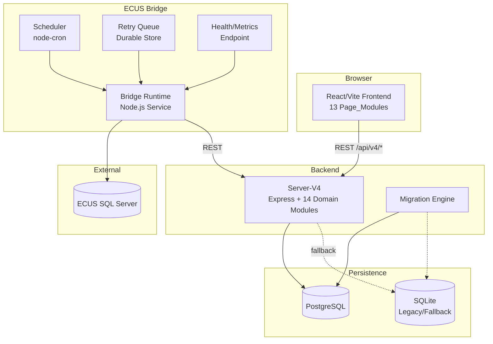
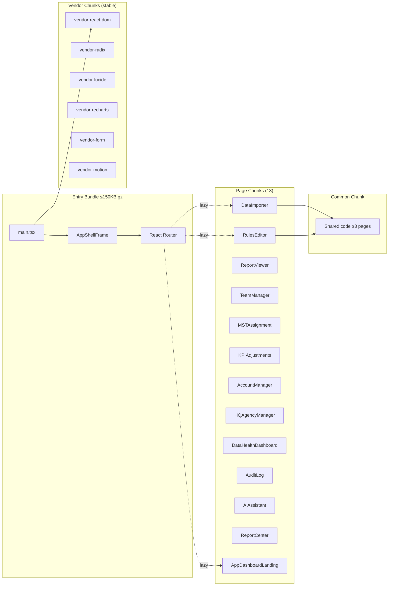
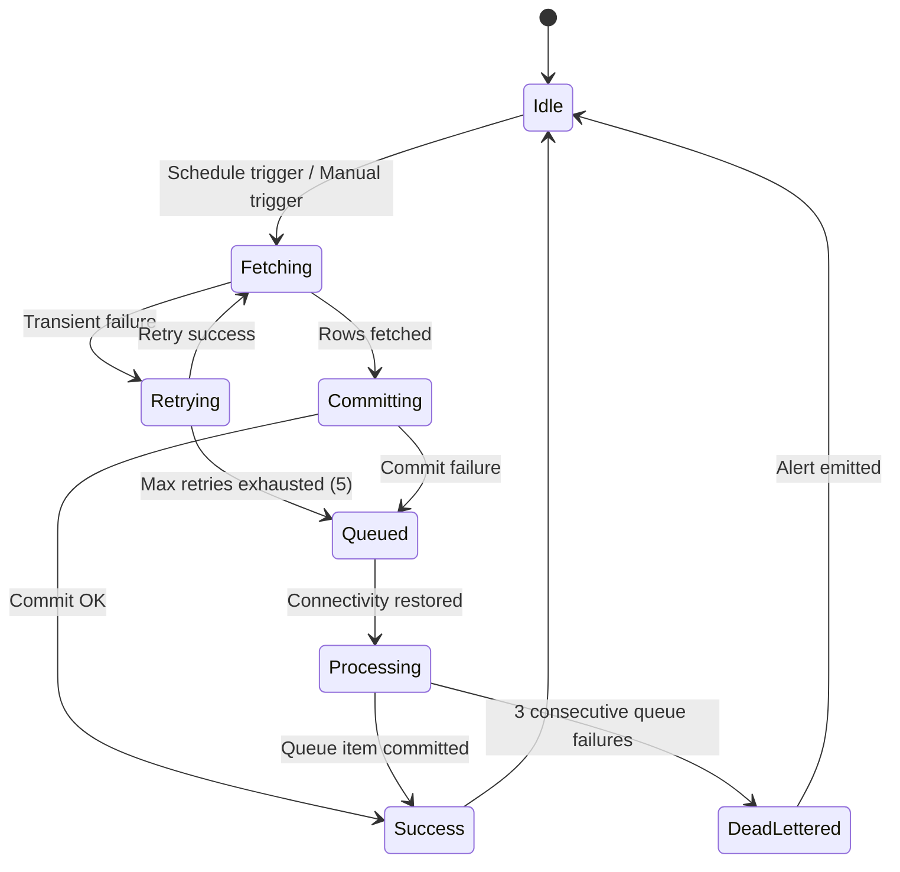

# Design Document: System Redesign 2026

## Overview

This design covers the comprehensive system redesign of the KPI Calculator application, building on the completed TypeScript migration (Phases 0–4). The redesign targets four pillars:

1. **Frontend Performance** — Route-level code splitting, vendor chunk optimization, and intelligent prefetching to achieve sub-2-second initial loads and instant subsequent navigation.
2. **Frontend UX Consistency** — Unified layout patterns, breadcrumb navigation, consistent form handling, and data-loss prevention across all 13 Page_Modules.
3. **Backend Completeness & ECUS Hardening** — Full API coverage verification, legacy server retirement, ECUS retry/recovery logic, scheduled auto-sync, and operational observability.
4. **Database Evolution** — Safe migration from SQLite to PostgreSQL with a versioned schema migration engine, proper relational constraints, and a data integrity migration tool.

### Key Design Decisions

| Decision | Rationale |
|----------|-----------|
| React.lazy + Suspense for code splitting | Already partially in use (KPICalculator.tsx); standardize across all 13 pages |
| Vite `manualChunks` with category-based vendor splitting | Existing config has partial vendor splitting; extend with frequency-based grouping |
| `node-cron` for ECUS scheduling | Already a dependency; avoid adding new scheduler libraries |
| `pg` Pool with exponential backoff | `pg` already installed; wrap with retry utility |
| Migration engine as a new `server-v4` module | Consistent with domain module pattern; migration metadata lives in the DB itself |
| Contract verification via static AST analysis | Build-time detection without runtime overhead |

---

## Architecture

### System Context Diagram



### Frontend Bundle Architecture



### ECUS Bridge Retry Architecture



---

## Components and Interfaces

### 1. Frontend Router & Code Splitting

**File:** `src/components/KPICalculator.tsx`

```typescript
// Route-level lazy loading (all 13 pages)
const PAGE_MODULES = {
  DataImporter: React.lazy(() => import('./DataImporter')),
  RulesEditor: React.lazy(() => import('./RulesEditor')),
  ReportViewer: React.lazy(() => import('./ReportViewer')),
  TeamManager: React.lazy(() => import('./TeamManager')),
  MSTAssignment: React.lazy(() => import('./MstHqContainer')),
  KPIAdjustments: React.lazy(() => import('./workflows/KPIAdjustmentsWorkflowPanel')),
  AccountManager: React.lazy(() => import('./AccountManager')),
  HQAgencyManager: React.lazy(() => import('./HQAgencyManager')),
  DataHealthDashboard: React.lazy(() => import('./DataHealthDashboard')),
  AuditLog: React.lazy(() => import('./AuditLog')),
  AiAssistant: React.lazy(() => import('./AiAssistant')),
  ReportCenter: React.lazy(() => import('./workflows/ReportCenterPanel')),
  AppDashboardLanding: React.lazy(() => import('./appShell/AppDashboardLanding')),
} as const;
```

**Prefetch Manager Interface:**

```typescript
interface PrefetchManager {
  /** Begin prefetching a page module by route key */
  prefetch(routeKey: keyof typeof PAGE_MODULES): void;
  /** Check if a module is already prefetched and cached */
  isReady(routeKey: keyof typeof PAGE_MODULES): boolean;
  /** Get current number of in-flight prefetches */
  inFlightCount(): number;
  /** Set navigation frequency data for idle-time prefetching */
  setFrequencyData(data: Map<string, number>): void;
}
```

**Navigation State Preservation:**

```typescript
interface PageState {
  scrollTop: number;
  filters: Record<string, unknown>;
  sortColumn?: string;
  sortDirection?: 'asc' | 'desc';
}

interface NavigationStateStore {
  save(routeKey: string, state: PageState): void;
  restore(routeKey: string): PageState | null;
  clear(routeKey: string): void;
}
```

### 2. Vite Chunk Strategy

**File:** `vite.config.js` — enhanced `manualChunks`

```typescript
interface ChunkCategory {
  name: string;
  test: (moduleId: string) => boolean;
  priority: number; // Higher priority wins on conflict
}

const CHUNK_CATEGORIES: ChunkCategory[] = [
  { name: 'vendor-react-dom', test: id => /react-dom|scheduler/.test(id), priority: 10 },
  { name: 'vendor-radix', test: id => /radix-ui/.test(id), priority: 9 },
  { name: 'vendor-lucide', test: id => /lucide-react/.test(id), priority: 8 },
  { name: 'vendor-recharts', test: id => /recharts|d3/.test(id), priority: 7 },
  { name: 'vendor-form', test: id => /zod|hookform|react-hook-form/.test(id), priority: 6 },
  { name: 'vendor-motion', test: id => /framer-motion/.test(id), priority: 5 },
  { name: 'vendor-misc', test: id => /node_modules/.test(id), priority: 1 },
];
```

**Build Manifest Reporter:**

```typescript
interface BuildManifestEntry {
  chunkName: string;
  files: string[];
  sizeBytes: number;
  sizeGzip: number;
  modules: string[];
}

interface BuildManifest {
  timestamp: string;
  totalSize: number;
  totalGzip: number;
  chunks: BuildManifestEntry[];
  criticalPathSize: number; // entry + shell + router gzip
}
```

### 3. Backend API Contract Layer

**File:** `server-v4/src/middleware/apiContract.ts`

```typescript
interface ApiErrorResponse {
  status: number;
  error: {
    code: string;          // Machine-readable, e.g. "TEAM_NOT_FOUND"
    message: string;       // Human-readable
    details?: unknown;     // Optional structured details
  };
}

interface ApiVersionHeaders {
  'X-API-Version': string;     // e.g. "4.1.0"
  'X-API-Module': string;      // e.g. "teams"
}
```

**Request Validation Middleware:**

```typescript
import { z } from 'zod';

function validateBody<T extends z.ZodType>(schema: T) {
  return (req: Request, res: Response, next: NextFunction) => {
    const result = schema.safeParse(req.body);
    if (!result.success) {
      return res.status(400).json({
        status: 400,
        error: {
          code: 'VALIDATION_FAILED',
          message: 'Request body validation failed',
          details: result.error.flatten(),
        },
      });
    }
    req.body = result.data;
    next();
  };
}
```

### 4. ECUS Bridge Retry & Recovery

**File:** `apps/ecus-bridge/src/retryEngine.ts`

```typescript
interface RetryConfig {
  maxAttempts: number;       // Default: 5
  initialDelayMs: number;   // Default: 1000
  maxDelayMs: number;       // Default: 60000
  backoffFactor: number;    // Default: 2
}

interface RetryQueueItem {
  id: string;
  payload: SyncRequest;
  createdAt: Date;
  attemptCount: number;
  lastAttemptAt: Date | null;
  lastError: string | null;
  status: 'pending' | 'processing' | 'dead-lettered';
}

interface RetryEngine {
  /** Execute operation with retry logic */
  withRetry<T>(operation: () => Promise<T>, config?: Partial<RetryConfig>): Promise<T>;
  /** Enqueue a failed request for later processing */
  enqueue(request: SyncRequest): Promise<string>;
  /** Process all pending queue items in FIFO order */
  processQueue(): Promise<QueueProcessingResult>;
  /** Get current queue depth */
  getQueueDepth(): Promise<number>;
}
```

**Backoff Delay Calculator (pure function):**

```typescript
function calculateBackoffDelay(
  attemptNumber: number,  // 1-based
  config: RetryConfig
): number {
  const delay = config.initialDelayMs * Math.pow(config.backoffFactor, attemptNumber - 1);
  return Math.min(delay, config.maxDelayMs);
}
```

### 5. ECUS Scheduler

**File:** `apps/ecus-bridge/src/syncScheduler.ts`

```typescript
interface SchedulerConfig {
  cronExpression: string;    // e.g. "0 */4 * * *" (every 4 hours)
  enabled: boolean;
}

interface SyncScheduler {
  start(config: SchedulerConfig): void;
  stop(): void;
  updateSchedule(config: SchedulerConfig): void;  // Hot-reload
  getStatus(): SchedulerStatus;
  isRunning(): boolean;
}

interface SchedulerStatus {
  cronExpression: string;
  enabled: boolean;
  lastSyncAt: Date | null;
  nextSyncAt: Date | null;
  syncInProgress: boolean;
}
```

### 6. ECUS Health & Observability

**File:** `apps/ecus-bridge/src/healthMonitor.ts`

```typescript
interface HealthReport {
  status: 'healthy' | 'degraded' | 'unhealthy';
  connectionStatus: 'connected' | 'disconnected' | 'degraded';
  lastSuccessfulSync: Date | null;
  queueDepth: number;
  errorCount: number;
  averageSyncDurationMs: number;
  p95SyncDurationMs: number;
  staleDataAlert: boolean;
  degradationDetails?: string;
}

interface SyncHistoryEntry {
  id: string;
  startedAt: Date;
  completedAt: Date;
  rowsFetched: number;
  rowsCommitted: number;
  outcome: 'success' | 'failure' | 'partial';
  errorMessage?: string;
  durationMs: number;
}

interface HealthMonitor {
  getHealth(): Promise<HealthReport>;
  recordSync(entry: Omit<SyncHistoryEntry, 'id'>): Promise<void>;
  checkStaleData(thresholdHours: number): boolean;
  computeStats(windowDays: number): { average: number; p95: number };
}
```

### 7. Data Migrator (SQLite → PostgreSQL)

**File:** `server-v4/src/migration/dataMigrator.ts`

```typescript
interface MigrationTableResult {
  tableName: string;
  sourceRowCount: number;
  destinationRowCount: number;
  durationMs: number;
  verified: boolean;
  checksumMatch: boolean;
}

interface MigrationReport {
  startedAt: Date;
  completedAt: Date;
  tables: MigrationTableResult[];
  overallStatus: 'success' | 'failed' | 'partial';
  failedTable?: string;
  error?: string;
}

interface DataMigrator {
  /** Run full migration with integrity verification */
  migrate(options?: { resumeFrom?: string }): Promise<MigrationReport>;
  /** Verify integrity of a single table */
  verifyTable(tableName: string): Promise<{ match: boolean; discrepancies: string[] }>;
  /** Get checkpoint (last successfully migrated table) */
  getCheckpoint(): string | null;
}
```

### 8. Schema Migration Engine

**File:** `server-v4/src/migration/migrationEngine.ts`

```typescript
interface MigrationFile {
  version: number;
  name: string;
  up: string;    // SQL for applying
  down: string;  // SQL for rollback
  checksum: string;
}

interface MigrationMetadata {
  version: number;
  name: string;
  appliedAt: Date;
  checksum: string;
}

interface MigrationEngine {
  /** Apply all pending migrations in version order */
  applyPending(): Promise<MigrationMetadata[]>;
  /** Rollback the most recent migration */
  rollbackLast(): Promise<MigrationMetadata>;
  /** Get list of applied migrations */
  getApplied(): Promise<MigrationMetadata[]>;
  /** Get list of pending migrations */
  getPending(): Promise<MigrationFile[]>;
  /** Validate migration files (no duplicates, checksums OK) */
  validate(): Promise<{ valid: boolean; errors: string[] }>;
}
```

### 9. Contract Verification Script

**File:** `scripts/check-frontend-api-contract.mjs` (already exists, to be enhanced)

```typescript
interface ContractGap {
  type: 'missing-backend' | 'unused-backend';
  pageModule?: string;
  method: string;
  path: string;
  source?: string;  // File location
}

interface ContractReport {
  timestamp: string;
  totalFrontendCalls: number;
  totalBackendEndpoints: number;
  missingBackend: ContractGap[];
  unusedBackend: ContractGap[];
  newGapsSinceLastRun: ContractGap[];
}
```

---

## Data Models

### Migration Metadata Table

```sql
CREATE TABLE IF NOT EXISTS _migrations (
  version      INTEGER PRIMARY KEY,
  name         TEXT NOT NULL,
  applied_at   TIMESTAMPTZ NOT NULL DEFAULT NOW(),
  checksum     TEXT NOT NULL,
  rolled_back  BOOLEAN NOT NULL DEFAULT FALSE
);
```

### Retry Queue Table (ECUS Bridge)

```sql
CREATE TABLE IF NOT EXISTS ecus_retry_queue (
  id             TEXT PRIMARY KEY,
  payload        JSONB NOT NULL,
  created_at     TIMESTAMPTZ NOT NULL DEFAULT NOW(),
  attempt_count  INTEGER NOT NULL DEFAULT 0,
  last_attempt   TIMESTAMPTZ,
  last_error     TEXT,
  status         TEXT NOT NULL DEFAULT 'pending'
    CHECK (status IN ('pending', 'processing', 'dead-lettered'))
);

CREATE INDEX idx_retry_queue_status ON ecus_retry_queue(status, created_at);
```

### Sync History Table (ECUS Bridge)

```sql
CREATE TABLE IF NOT EXISTS ecus_sync_history (
  id              TEXT PRIMARY KEY,
  started_at      TIMESTAMPTZ NOT NULL,
  completed_at    TIMESTAMPTZ NOT NULL,
  rows_fetched    INTEGER NOT NULL,
  rows_committed  INTEGER NOT NULL,
  outcome         TEXT NOT NULL CHECK (outcome IN ('success', 'failure', 'partial')),
  error_message   TEXT,
  duration_ms     INTEGER NOT NULL
);

CREATE INDEX idx_sync_history_started ON ecus_sync_history(started_at DESC);
```

### PostgreSQL Schema Improvements (Example: Teams)

```sql
-- Example: teams table with proper constraints
CREATE TABLE teams (
  id          UUID PRIMARY KEY DEFAULT gen_random_uuid(),
  name        TEXT NOT NULL,
  agency_id   UUID NOT NULL REFERENCES hq_agencies(id) ON DELETE RESTRICT,
  created_at  TIMESTAMPTZ NOT NULL DEFAULT NOW(),
  updated_at  TIMESTAMPTZ NOT NULL DEFAULT NOW()
);

CREATE TABLE team_members (
  id          UUID PRIMARY KEY DEFAULT gen_random_uuid(),
  team_id     UUID NOT NULL REFERENCES teams(id) ON DELETE CASCADE,
  user_id     UUID NOT NULL,
  role        TEXT NOT NULL CHECK (role IN ('leader', 'member')),
  created_at  TIMESTAMPTZ NOT NULL DEFAULT NOW(),
  updated_at  TIMESTAMPTZ NOT NULL DEFAULT NOW(),
  UNIQUE(team_id, user_id)
);

-- Auto-update updated_at
CREATE OR REPLACE FUNCTION update_updated_at()
RETURNS TRIGGER AS $$
BEGIN
  NEW.updated_at = NOW();
  RETURN NEW;
END;
$$ LANGUAGE plpgsql;

CREATE TRIGGER trg_teams_updated_at
  BEFORE UPDATE ON teams
  FOR EACH ROW EXECUTE FUNCTION update_updated_at();
```

### Navigation Frequency Store (Frontend)

```typescript
// Persisted to localStorage
interface NavigationFrequency {
  routeKey: string;
  visitCount: number;
  lastVisitedAt: number; // timestamp
}
```

### Build Manifest (Output Artifact)

```json
{
  "timestamp": "2026-06-15T10:30:00Z",
  "totalSize": 2048000,
  "totalGzip": 680000,
  "criticalPathSize": 142000,
  "chunks": [
    {
      "chunkName": "vendor-react-dom",
      "files": ["assets/vendor-react-dom-abc123.js"],
      "sizeBytes": 180000,
      "sizeGzip": 58000,
      "modules": ["react-dom", "scheduler"]
    }
  ]
}
```

---

## Correctness Properties

*A property is a characteristic or behavior that should hold true across all valid executions of a system — essentially, a formal statement about what the system should do. Properties serve as the bridge between human-readable specifications and machine-verifiable correctness guarantees.*

### Property 1: Dependency Chunk Categorization

*For any* npm package identifier string, the chunk categorization function SHALL assign it to exactly one vendor chunk category based on its module path, and that assignment SHALL be deterministic (same input always produces same output).

**Validates: Requirements 2.4**

### Property 2: Navigation Frequency Top-N Selection

*For any* array of navigation frequency entries and any N > 0, the top-N selection function SHALL return exactly min(N, entries.length) items, and every returned item SHALL have a visitCount >= every non-returned item's visitCount.

**Validates: Requirements 3.2**

### Property 3: Prefetch Concurrency Limit Invariant

*For any* sequence of prefetch trigger events, the prefetch manager SHALL never have more than 2 prefetch operations in-flight simultaneously at any point in time.

**Validates: Requirements 3.3**

### Property 4: Breadcrumb Generation from Route Path

*For any* valid application route path, the breadcrumb generator SHALL produce an ordered array of segments where each segment's path is a prefix of the next, and the final segment's path equals the input route path.

**Validates: Requirements 4.2**

### Property 5: Navigation State Round-Trip Preservation

*For any* PageState object (scroll position + filter state), saving it via NavigationStateStore.save() and then restoring it via NavigationStateStore.restore() SHALL return an object deeply equal to the original.

**Validates: Requirements 4.4**

### Property 6: Dirty Form Detection

*For any* form with an initial clean state, if any field value is changed to differ from its initial value, the dirty detection function SHALL return true; if all field values equal their initial values, it SHALL return false.

**Validates: Requirements 5.1**

### Property 7: Field Validation Error Generation

*For any* field value that does not satisfy its Zod schema constraint, the validation function SHALL return a non-empty error message string; for any field value that satisfies the schema, it SHALL return no error.

**Validates: Requirements 5.2**

### Property 8: API Response Contract Invariants

*For any* HTTP response from any Server_V4 endpoint: (a) error responses SHALL match the `ApiErrorResponse` schema shape, (b) responses to requests with invalid bodies SHALL have status 400 with code `VALIDATION_FAILED`, and (c) all responses SHALL include `X-API-Version` and `X-API-Module` headers.

**Validates: Requirements 6.2, 6.3, 6.5**

### Property 9: Exponential Backoff Delay Calculation

*For any* attempt number (1..maxAttempts) and any valid RetryConfig, `calculateBackoffDelay(attempt, config)` SHALL return `min(initialDelay * factor^(attempt-1), maxDelay)`, and the result SHALL be monotonically non-decreasing with attempt number.

**Validates: Requirements 8.1**

### Property 10: Retry Queue FIFO Ordering

*For any* sequence of enqueued sync requests, when `processQueue()` is called, items SHALL be dequeued and processed in the order they were enqueued (earliest `createdAt` first).

**Validates: Requirements 8.3**

### Property 11: Sync Concurrency Guard

*For any* sequence of schedule triggers arriving at arbitrary times, if a sync operation is already in progress, subsequent triggers SHALL be skipped (not queued), resulting in at most one active sync operation at any point in time.

**Validates: Requirements 9.3**

### Property 12: Sync History Record Completeness

*For any* completed sync operation (success or failure), the recorded `SyncHistoryEntry` SHALL contain non-null values for `startedAt`, `completedAt`, `rowsFetched`, `rowsCommitted`, `outcome`, and `durationMs`, where `durationMs` equals `completedAt - startedAt`.

**Validates: Requirements 10.2**

### Property 13: Stale-Data Alert Threshold

*For any* pair (lastSyncTime, threshold), `checkStaleData()` SHALL return true if and only if `(now - lastSyncTime) > threshold`. The function SHALL be monotonic: if it returns true for threshold T, it returns true for any T' < T.

**Validates: Requirements 10.3**

### Property 14: Duration Statistics Calculation

*For any* non-empty array of sync durations, `computeStats()` SHALL return an average equal to sum/count, and a p95 value equal to the ceil(0.95 * count)-th smallest value when sorted ascending.

**Validates: Requirements 10.4**

### Property 15: Migration Data Integrity Round-Trip

*For any* set of rows in a SQLite source table, after `DataMigrator.migrate()` completes successfully, the PostgreSQL destination table SHALL contain exactly the same rows (same count, same field values per row) as the source.

**Validates: Requirements 11.1, 11.2**

### Property 16: Migration Rollback Atomicity

*For any* migration that encounters a data integrity verification failure at table N, the PostgreSQL database SHALL be left in exactly the state it was in before the migration began (no partial data from tables 1..N-1 persisted).

**Validates: Requirements 11.3**

### Property 17: Resumable Migration Checkpoint

*For any* interruption after successfully migrating tables 1..K, calling `migrate({ resumeFrom: checkpoint })` SHALL skip tables 1..K and begin from table K+1, producing a final result equivalent to an uninterrupted migration.

**Validates: Requirements 11.4**

### Property 18: Schema Migration Sequential Ordering

*For any* set of pending migration files with distinct version numbers, `applyPending()` SHALL apply them in strictly ascending version order, and the metadata table SHALL reflect this ordering in `applied_at` timestamps.

**Validates: Requirements 12.2**

### Property 19: Schema Migration Apply-Rollback Round-Trip

*For any* migration with valid up and down scripts, applying the migration and then rolling it back SHALL return the database schema to its pre-migration state (table structure, constraints, indexes unchanged).

**Validates: Requirements 12.3**

### Property 20: Failed Migration Transaction Atomicity

*For any* migration whose `up` script produces an error at any statement, the Migration_Engine SHALL roll back the entire transaction, leaving the database at the version prior to the failed migration with no partial DDL applied.

**Validates: Requirements 12.4**

### Property 21: Duplicate Migration Version Rejection

*For any* set of migration files containing two or more entries with the same version number, `validate()` SHALL return `{ valid: false }` with an error message identifying the duplicate version.

**Validates: Requirements 12.5**

### Property 22: Foreign Key Constraint Enforcement

*For any* INSERT or UPDATE that references a non-existent foreign key value, the PostgreSQL_Store SHALL reject the operation and return a structured error before the row is persisted.

**Validates: Requirements 13.1**

### Property 23: Constraint Violation Structured Error

*For any* write operation that violates a database constraint (FK, NOT NULL, UNIQUE, CHECK), the Persistence_Layer SHALL return an error object containing the constraint name, violation type, and affected column(s).

**Validates: Requirements 13.4**

### Property 24: Timestamp Auto-Population

*For any* entity INSERT, `created_at` and `updated_at` SHALL be set to the current time; for any UPDATE, `updated_at` SHALL be updated to the current time while `created_at` remains unchanged.

**Validates: Requirements 13.5**

### Property 25: Contract Verification Gap Detection

*For any* set of frontend API calls F and backend registered endpoints B: (a) every element in F \ B SHALL appear in the `missingBackend` report with its Page_Module, method, and path; and (b) every element in B \ F SHALL appear in the `unusedBackend` report.

**Validates: Requirements 14.2, 14.3**

---

## Error Handling

### Frontend Error Handling Strategy

| Scenario | Handling | User Experience |
|----------|----------|----------------|
| Page module load failure | `RuntimeErrorBoundary` catches, shows retry prompt | Retry button + human-readable message |
| API 4xx error | Toast notification with error message | Error toast with optional retry action |
| API 5xx error | Toast notification + log to telemetry | "Something went wrong, try again" + retry |
| API network timeout | Retry with backoff (max 3 attempts) | Loading indicator → error after exhaustion |
| Form validation failure | Inline field-level errors | Red border + error text below field |
| Unsaved form navigation | Navigation guard with confirmation dialog | "You have unsaved changes" modal |

### Backend Error Handling Strategy

| Scenario | Status Code | Error Code | Behavior |
|----------|-------------|------------|----------|
| Request body validation fails | 400 | `VALIDATION_FAILED` | Return Zod error details |
| Resource not found | 404 | `{RESOURCE}_NOT_FOUND` | Machine-readable code |
| Unauthorized | 401 | `AUTH_REQUIRED` | Redirect to login |
| Forbidden | 403 | `PERMISSION_DENIED` | Explain required permission |
| Constraint violation (DB) | 409 | `CONSTRAINT_VIOLATION` | Identify constraint + column |
| Internal error | 500 | `INTERNAL_ERROR` | Generic message, log details |

### ECUS Bridge Error Handling

| Scenario | Behavior | Recovery |
|----------|----------|----------|
| SQL Server connection refused | Exponential backoff: 1s, 2s, 4s, 8s, 16s (cap 60s) | Auto-retry up to 5 times |
| All retries exhausted | Persist to retry queue | Process when connectivity restored |
| Queue item fails 3 times | Dead-letter + alert notification | Manual intervention required |
| Sync timeout (>5 min) | Abort current sync, log timeout | Next scheduled sync proceeds normally |
| SQL Server health degradation | Log warning, continue with reduced batch size | Include in health endpoint |

### Database Migration Error Handling

| Scenario | Behavior | Recovery |
|----------|----------|----------|
| Migration script SQL error | Transaction rollback | DB remains at previous version |
| Data integrity verification fails | Halt migration, rollback destination | Report discrepancy, manual review |
| Migration interrupted (crash) | Resume from checkpoint on restart | Skip completed tables |
| Duplicate version detected | Reject at validation time | Developer fixes file naming |
| PostgreSQL connection lost during migration | Transaction rolled back automatically | Resumable from checkpoint |

---

## Testing Strategy

### Unit Tests (Example-Based)

Unit tests cover specific scenarios, edge cases, and integration points:

- **Frontend**: React Testing Library for component rendering, user interactions, form submission flows
- **Backend**: Supertest for API endpoint behavior with mocked persistence
- **ECUS Bridge**: Mock SQL Server responses for sync pipeline scenarios
- **Migration**: Mock databases for verifying migrator behavior at boundaries

### Property-Based Tests

Property-based testing validates universal correctness properties using `fast-check` (already compatible with the Vitest test runner).

**Configuration:**
- Minimum 100 iterations per property test
- Each property test tagged with: `Feature: system-redesign-2026, Property {N}: {title}`
- Tests run as part of `pnpm test:all`

**Property tests cover:**
1. Pure function logic: backoff calculation, chunk categorization, frequency selection, statistics computation
2. Data invariants: FIFO ordering, concurrency guards, timestamp population
3. Round-trip properties: navigation state, migration data integrity, schema apply/rollback
4. Constraint properties: FK enforcement, validation rejection, duplicate detection
5. Set operations: contract gap detection (F \ B and B \ F)

### Integration Tests

- **API Contract**: End-to-end verification that frontend calls match backend endpoints
- **Migration Engine**: Run against real SQLite and PostgreSQL test databases
- **ECUS Bridge**: Mock SQL Server with realistic data volumes
- **Build Verification**: Validate chunk sizes and manifest after production build

### Smoke Tests

- Build output contains 13 page chunks
- Entry bundle ≤ 150KB gzipped
- Vendor chunks grouped correctly
- Legacy server imports absent
- CI pipeline passes without legacy server files
- Migration metadata table schema correct
- PostgreSQL indexes exist for query columns

### Accessibility Testing

- `vitest-axe` for component-level WCAG 2.1 AA checks
- Playwright with `axe-core` for full-page accessibility audits
- Manual testing with screen readers for complex interactions

### Performance Testing

- Lighthouse CI for core web vitals after code splitting
- Bundle size regression detection via build manifest comparison
- Sync duration benchmarks for ECUS bridge under load
