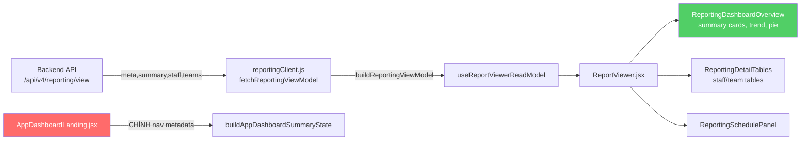
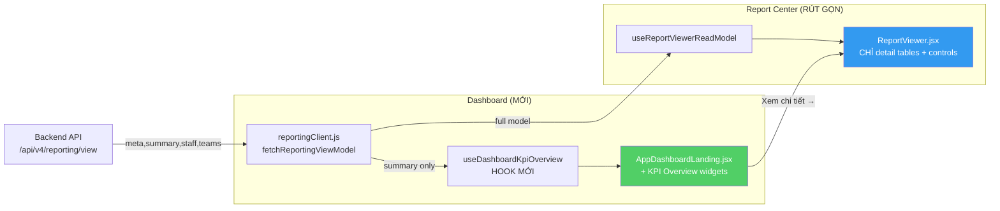

# 🔍 KPI Command — UX/UI System Audit

> **Ngày tạo**: 2026-04-21  
> **Vai trò**: Senior UX Architect — Enterprise Systems  
> **Phạm vi**: Toàn bộ hệ thống KPI Command v4  
> **Cập nhật lần cuối**: 2026-04-21 (v2 — Dashboard KPI Redesign + Backend Impact)

---

## PHẦN 0 — EXECUTIVE SUMMARY

Hệ thống KPI Command có **kiến trúc component tốt**, design system nhất quán (glassmorphism + slate/amber), nhưng **UX vận hành yếu** vì 3 vấn đề cốt lõi:

1. **Over-explaining** — Mỗi trang đều có Workflow Guide + SectionHeader description chiếm 200–300px đầu trang, đẩy nội dung chính xuống below-the-fold
2. **Flat architecture** — Tất cả chức năng nằm trên 1 màn hình dài cuộn, không có tab/section rõ ràng trong từng trang
3. **Dashboard trống rỗng** — Dashboard không hiển thị dữ liệu KPI thực (tờ khai, điểm, xu hướng...), chỉ có metadata navigation

> [!CAUTION]
> **Thay đổi kiến trúc lớn**: Dashboard cần **nhúng KPI overview** (đang nằm trong Report Center), còn Report Center chỉ giữ dữ liệu chi tiết. Thay đổi này ảnh hưởng cả frontend và backend.

---

## 🆕 PHẦN 0.5 — DASHBOARD KPI REDESIGN (YÊU CẦU MỚI)

### Bối cảnh

**Hiện tại**:
- **Dashboard** ([AppDashboardLanding.jsx](file:///e:/GPT/kpi_source_code_v4/src/components/appShell/AppDashboardLanding.jsx)) chỉ hiển thị: số module (8), số section (3), số bề mặt hỗ trợ (1), quick actions, module map → **KHÔNG CÓ DỮ LIỆU KPI**
- **Report Center** ([ReportViewer.jsx](file:///e:/GPT/kpi_source_code_v4/src/components/ReportViewer.jsx)) hiển thị TẤT CẢ: controls + overview (summary cards + executive summary + trend chart + pie charts + top staff + adjustments) + detail tables + schedule + notes → **QUÁ TẢI**

**Đề xuất mới**:
- **Dashboard** = KPI Overview (tổng quan) — lấy executive summary, summary cards, trend chart, pie charts từ Report Center
- **Report Center** = Chi tiết KPI — chỉ giữ controls, detail tables (staff/team), export, schedule
- Dashboard có link "Xem chi tiết →" dẫn sang Report Center

### Data Flow hiện tại



### Data Flow đề xuất



### Redesign chi tiết

#### Dashboard MỚI — Layout

```
┌─────────────────────────────────────────────────────────┐
│  TỔNG QUAN KPI            Kỳ: Tháng 4/2026  [Reload]   │
│  ─────────────────────────────────────────────────────── │
│  ┌─────────┐ ┌──────────┐ ┌──────────┐ ┌─────────────┐ │
│  │Tổng TK  │ │Tổng KPI  │ │KPI +/-   │ │Tổng công ty │ │
│  │  125     │ │  18.50   │ │  +2.05   │ │     42      │ │
│  │Import:80 │ │Loại hình │ │Duyệt:5  │ │Quản lý 3 tổ │ │
│  │Export:45 │ │& giấy phép││Chờ:2    │ │             │ │
│  └─────────┘ └──────────┘ └──────────┘ └─────────────┘ │
│                                                         │
│  ┌── TÓM TẮT ĐIỀU HÀNH ────────────────────────────┐   │
│  │  Điểm KPI kỳ: 18.50 | So kỳ trước: +12%         │   │
│  │  Nhân sự đứng đầu: Nguyễn Văn A (3.2 điểm)      │   │
│  │  Đội đứng đầu: Team 1 (45% tờ khai)              │   │
│  └──────────────────────────────────────────────────┘   │
│                                                         │
│  ┌── XU HƯỚNG KPI 6 KỲ ──┐  ┌── PHÂN BỐ TỔ ĐỘI ──┐  │
│  │  📈 Line chart (trend)  │  │  🥧 Pie chart (team) │  │
│  └────────────────────────┘  └──────────────────────┘  │
│                                                         │
│  ┌── HÀNH ĐỘNG NHANH ──────────────────────────────┐   │
│  │ [Import Data]  [Gán MST]  [Xem chi tiết báo cáo →] │
│  └──────────────────────────────────────────────────┘   │
└─────────────────────────────────────────────────────────┘
```

#### Report Center RÚT GỌN — Layout

```
┌─────────────────────────────────────────────────────────┐
│  BÁO CÁO KPI CHI TIẾT             [← Về Dashboard]     │
│  ─────────────────────────────────────────────────────── │
│  Controls: [Khoảng TG ▼] [Bộ quy tắc ▼]  [🔄 Reload]  │
│  ─────────────────────────────────────────────────────── │
│  Tab: [📋 Nhân viên] [👥 Tổ đội] [📊 Xuất báo cáo]     │
│                                                          │
│  ┌── BẢNG CHI TIẾT NHÂN VIÊN ───────────────────────┐  │
│  │ STT | Tên NV | Tổ đội | TK Import | TK Export |..│  │
│  │ ... (paginated table)                              │  │
│  └───────────────────────────────────────────────────┘  │
│                                                          │
│  [Xuất Excel ▼]  [Lịch gửi báo cáo ⚙️]                 │
└─────────────────────────────────────────────────────────┘
```

### Backend Impact Analysis

#### Endpoint hiện tại: `GET /api/v4/reporting/view`

**Response structure** (từ [buildReportingViewModel](file:///e:/GPT/kpi_source_code_v4/packages/api-client/src/reportingClient.js#556-576)):
```js
{
  meta: { from, to, generatedAt },
  summary: { decls, import, export, kpi, licenses, co, ... },
  trend: [{ period, kpi, decls }...],
  adjustments: { totalPoints, approvedCount, pendingCount, items },
  range: { from, to },
  rules: { id, name, ... },
  companies: { groups, rows },
  staff: { items: [{ name, team, kpi, decls, ... }] },
  teams: { items: [{ name, kpi, decls, declPercent, ... }] },
}
```

#### Backend thay đổi cần thiết

| # | Thay đổi | Chi tiết | Effort |
|---|---------|----------|--------|
| **BE1** | `GET /api/v4/reporting/summary` (MỚI) | Endpoint nhẹ trả **chỉ** `{summary, trend, adjustments, rules, teams.items}` — KHÔNG trả staff items (data nặng). Dashboard gọi endpoint này để load nhanh | 2h |
| **BE2** | `GET /api/v4/reporting/view` (GIỮ NGUYÊN) | Endpoint đầy đủ cho Report Center chi tiết — giữ nguyên, không thay đổi | 0h |
| **BE3** | Default date range trên BE | Nếu không truyền `from/to`, backend auto-fill tháng hiện tại (`firstDayOfMonth` → `today`) thay vì trả error | 1h |

> [!IMPORTANT]
> **Quyết định kiến trúc**: Tạo endpoint `/api/v4/reporting/summary` riêng cho Dashboard thay vì reuse `/api/v4/reporting/view` vì:
> 1. Dashboard chỉ cần summary + trend + adjustments (nhẹ), không cần hàng trăm staff records
> 2. Dashboard load MỒI LẦN MỞ APP → cần fast response (<200ms)
> 3. Report Center load ON-DEMAND khi user đến tab → chấp nhận slower response
>
> **Nếu backend đơn giản**, có thể reuse endpoint cũ trước và chỉ lọc data ở frontend. Tạo endpoint riêng sau nếu performance trở thành vấn đề.

#### Frontend thay đổi cần thiết

| # | File | Thay đổi | Effort |
|---|------|---------|--------|
| **FE1** | [reportingClient.js](file:///e:/GPT/kpi_source_code_v4/packages/api-client/src/reportingClient.js) | Thêm `fetchDashboardSummary()` gọi `/api/v4/reporting/summary` hoặc reuse [fetchReportingViewModel()](file:///e:/GPT/kpi_source_code_v4/packages/api-client/src/reportingClient.js#756-762) với filter | 1h |
| **FE2** | `useDashboardKpiOverview.js` (MỚI) | Custom hook: auto-load KPI summary khi mount, auto-fill date range = tháng hiện tại, expose `{summary, trend, adjustments, teamPie, loading, error, reload}` | 2h |
| **FE3** | [AppDashboardLanding.jsx](file:///e:/GPT/kpi_source_code_v4/src/components/appShell/AppDashboardLanding.jsx) | Xóa Module Map + Summary Cards cũ. Thêm KPI SummaryCards + ExecutiveSummary + TrendChart + TeamPie. Thêm "Xem chi tiết →" link | 3h |
| **FE4** | [ReportViewer.jsx](file:///e:/GPT/kpi_source_code_v4/src/components/ReportViewer.jsx) | Xóa [ReportingDashboardOverview](file:///e:/GPT/kpi_source_code_v4/src/components/reporting/ReportingDashboardOverview.jsx#12-136) section (summary cards, executive summary, trend chart, pie charts). Giữ controls + detail tables + schedule + export | 2h |
| **FE5** | [ReportingDashboardOverview.jsx](file:///e:/GPT/kpi_source_code_v4/src/components/reporting/ReportingDashboardOverview.jsx) | Refactor: tách widgets thành standalone imports (đã tách rời qua `ReportingOverviewWidgets.jsx`) → reuse trên Dashboard | 1h |
| **FE6** | Navigation links | Dashboard: thêm nút "Xem chi tiết báo cáo →" navigate đến `?section=performance&tab=reports`. Report Center: thêm nút "← Về tổng quan" navigate về dashboard | 30m |

---

## PHẦN 1 — GLOBAL UX AUDIT

### 1.1 Navigation & Information Architecture

**Hiện tại**: 5 section → 13 tab.

```
TỔNG QUAN
  └─ Tổng quan KPI (dashboard)
VẬN HÀNH
  ├─ Gán MST
  ├─ Đại Lý HQ
  └─ Import Data
HIỆU SUẤT
  ├─ Quản lý Tổ đội
  ├─ Quy tắc KPI
  ├─ Điểm KPI +/- Thêm
  └─ Báo cáo KPI
GIÁM SÁT
  ├─ Sức khỏe dữ liệu
  └─ Trợ lý AI
QUẢN TRỊ
  ├─ Tài khoản
  ├─ Nhật ký
  └─ Lịch sử export
```

#### 🟥 Vấn đề

| # | Vấn đề | Chi tiết |
|---|--------|----------|
| N1 | **Phân nhóm sai mental model** | "Điểm KPI +/- Thêm" là hành động sửa, nhưng nằm cùng Báo cáo (chỉ đọc) |
| N2 | **"Đại Lý HQ" tách rời "Gán MST"** | Cùng về quản lý đối tác, nên gộp |
| N3 | **Dashboard trùng Module Map** | Sidebar đã hiển thị toàn bộ → Module Map lặp 100% |
| N4 | **Section "Giám sát" chỉ 2 tab** | Quá ít, nên hợp nhất |

#### 🟩 Đề xuất IA mới

```
TỔNG QUAN
  └─ Dashboard (KPI overview metrics + quick actions)

VẬN HÀNH
  ├─ Import Data
  ├─ Quản lý MST & Đại lý  ← GỘP
  └─ Sức khỏe dữ liệu

CẤU HÌNH
  ├─ Tổ đội
  ├─ Quy tắc KPI
  └─ Điều chỉnh KPI +/-

BÁO CÁO
  ├─ Report Center (CHI TIẾT)
  └─ Lịch sử export

QUẢN TRỊ
  ├─ Tài khoản
  ├─ Nhật ký
  └─ Trợ lý AI
```

---

### 1.2 User Journey — End-to-End Flow

**Flow chính**: Import → Rà soát → Gán MST → Tính điểm → Báo cáo

#### 🟥 Điểm đứt gãy

| # | Step | Vấn đề |
|---|------|--------|
| J1 | Import → Gán MST | Không có link trực tiếp |
| J2 | Gán MST → Kiểm tra | Không "xem nhanh" KPI ngay sau gán → phải sang Report Center |
| J3 | Dashboard → Chi tiết báo cáo | **Dashboard hiện không có KPI** → user phải tự tìm Report Center |
| J4 | Report Center → Điều chỉnh KPI | Chiều ngược không có link |

#### 🟩 Đề xuất

- Dashboard hiển thị **KPI overview** với link "Xem chi tiết →" đến Report Center
- Thêm contextual action links cuối mỗi workflow step
- Sidebar badge cảnh báo: Import xong chưa gán MST → hiện badge

---

### 1.3 Consistency — Tổng soát inconsistency

| # | Thành phần | Vấn đề |
|---|-----------|--------|
| C1 | **Page Header** | Mỗi trang layout khác |
| C2 | **Workflow Guide** | Mỗi trang tên khác ("MST Queue", "Operator", "Import", "Adjustment") |
| C3 | **Filter bar** | MST: buttons, HQ: dropdowns, Import: complex form |
| C4 | **Table** | 3+ custom implementations |
| C5 | **Button** | Primary: `bg-black`, `bg-teal-600`, `bg-slate-800`, `bg-emerald-600` |
| C6 | **Empty state** | 4 kiểu wording khác nhau |
| C7 | **Date format** | `mm/dd/yyyy`, `April 2026`, `04/01/2026` |

---

### 1.4 Cognitive Load — Khu vực noise lớn nhất

| # | Khu vực | Trang | Pixels lãng phí | Hành động |
|---|---------|-------|-----------------|-----------|
| CL1 | **Workflow Guide banners** | ALL (8 trang) | ~2400px tổng | **XÓA TOÀN BỘ** |
| CL2 | **"Ghi chú báo cáo KPI"** | Report Center | 200px | **XÓA** |
| CL3 | **"Sơ đồ report center"** 3 cards | Report Center | 150px | **XÓA** |
| CL4 | **Dashboard Landing text** | Dashboard | 180px | **THAY bằng KPI overview** |
| CL5 | **SectionHeader descriptions** | ALL | 60px mỗi cái | **XÓA** |

---

## PHẦN 2 — PAGE-BY-PAGE REVIEW

### 2.1 Dashboard (Tổng quan KPI) — REDESIGN LỚN


#### 🟥 Vấn đề (10+)

| # | Vấn đề | Priority |
|---|--------|----------|
| D1 | **KHÔNG CÓ DỮ LIỆU KPI** — Dashboard chỉ hiện metadata nav (3 section, 8 module, 1 hỗ trợ) | **Critical** |
| D2 | **Module Map** lặp 100% sidebar | High |
| D3 | **"Dashboard Landing" text block** 180px mô tả | High |
| D4 | **3 Summary Cards** (3/8/1) không actionable value | High |
| D5 | **3-step workflow cards** 200px mô tả cách dùng | High |
| D6 | **Không có alerts/warnings** | High |
| D7 | Quick Actions quá to so với nội dung (chỉ 3 items) | Medium |
| D8 | Status pills ("Chế độ khách", "8 module") metadata không phải action | Medium |
| D9 | Title "Tổng quan KPI" nhưng không có KPI nào | Medium |
| D10 | Info tooltips dày đặc, mỗi card 1 cái | Low |

#### 🟩 Redesign — Dashboard = KPI Overview

**XÓA hoàn toàn**:
- Module Map panel
- Summary Cards (3/8/1)  
- Workflow Guide 3-step cards
- Dashboard Landing text block
- Status pills

**THÊM MỚI (di chuyển từ Report Center)**:
1. **KPI Summary Cards** (4 cards): Tổng tờ khai, Tổng điểm KPI, KPI +/- bổ sung, Tổng công ty
2. **Executive Summary Panel**: Tóm tắt điều hành (điểm kỳ, so sánh, top staff, top team)
3. **Trend Line Chart**: Xu hướng KPI 6 kỳ gần nhất
4. **Team Pie Charts**: Phân bổ KPI và tờ khai theo tổ đội
5. **Link "Xem chi tiết báo cáo →"**: Navigate đến Report Center

**Data flow mới**:
```
Dashboard mount → useDashboardKpiOverview() → fetchReportingViewModel({from: firstOfMonth, to: today})
  → Chỉ render: summary + trend + adjustments + teams (pie)
  → KHÔNG render: staff detail table, schedule, export
```

#### Impact lên backend

> [!IMPORTANT]
> **Phương án GĐ1 (MVP - Reuse)**: Frontend gọi cùng `/api/v4/reporting/view`, nhưng **chỉ render phần overview**. Không cần sửa backend.
>
> **Phương án GĐ2 (Optimize)**: Tạo `/api/v4/reporting/summary` endpoint mới trả kết quả nhẹ hơn (bỏ staff items) nếu Dashboard load chậm.

---

### 2.2 Report Center — RÚT GỌN


#### 🟥 Vấn đề sau Redesign

| # | Vấn đề | Priority |
|---|--------|----------|
| R1 | **Trang 4000px scroll** — quá tải | Critical |
| R2 | Workflow guide + "Sơ đồ report center" 400px | High |
| R3 | "Ghi chú báo cáo KPI" cuối trang | High |
| R4 | "Audit trail chưa khả dụng" — không liên quan | High |
| R5 | **Overview section trùng Dashboard** — sau redesign sẽ có 2 nơi hiện cùng data | **Critical** |
| R6 | Controls panel vertical stack — nên horizontal compact | High |
| R7 | Staff + Team tables + pie charts mixed cùng overview | High |

#### 🟩 Redesign — Report Center = Chi tiết only

**XÓA khỏi Report Center** (đã chuyển lên Dashboard):
- [ReportingDashboardOverview](file:///e:/GPT/kpi_source_code_v4/src/components/reporting/ReportingDashboardOverview.jsx#12-136) (summary cards, executive summary, trend chart, pie charts)
- "Sơ đồ report center" guide
- "Ghi chú báo cáo KPI"
- "Audit trail chưa khả dụng"
- Workflow Guide banner

**GIỮ LẠI + CẢI THIỆN**:
1. **Controls panel** (compact horizontal): Date range + Rule selector + Reload button
2. **Tab-based detail views**: `[📋 Nhân viên] [👥 Tổ đội] [📊 Xuất báo cáo]`
3. **Staff detail table** (paginated, sortable, searchable)
4. **Team detail table** (paginated)
5. **Export controls** (dropdown: Excel/CSV/PDF)
6. **Schedule panel** (admin only, collapsible)
7. **Link "← Về tổng quan Dashboard"**

---

### 2.3 Gán MST


| # | Vấn đề | Priority |
|---|--------|----------|
| M1 | Workflow Guide banner 250px | High |
| M2 | 4 export buttons → gộp 1 dropdown | High |
| M3 | "Bộ lọc nhân viên" luôn visible 200px | Medium |
| M4 | "Bộ lọc lịch sử" luôn visible | Medium |
| M5 | Toolbar 10+ controls 1 hàng | High |
| M7 | Không bulk actions | High |
| M9 | Trang không tabs — all stacked | Medium |

**Đề xuất**: Xóa guide, gộp exports, tách tabs `[Bảng] [Lọc nâng cao] [Lịch sử]`, thêm bulk select.

---

### 2.4 Đại Lý HQ


| # | Vấn đề | Priority |
|---|--------|----------|
| H1 | "Operator Workflow" banner 300px+ | High |
| H3 | Nên gộp vào tab MST | High |
| H8 | Subtitle mô tả dài 2 dòng | Medium |

**Đề xuất**: Gộp vào MST module thành sub-tab `[Gán MST] [Đại lý HQ]`. Xóa workflow banner.

---

### 2.5 Import Data


| # | Vấn đề | Priority |
|---|--------|----------|
| I1 | "Import Workflow" banner 250px | High |
| I2 | 2 cảnh báo quyền chồng nhau | High |
| I3 | 3 steps đồng thời trên 1 trang scroll dài | High |
| I4 | Step 2 filter quá phức tạp, hiện hết | High |
| I6 | Date format `mm/dd/yyyy` (US) | Medium |

**Đề xuất**: Wizard mode (1 step/lần), gộp 2 alerts, collapse advanced filters.

---

### 2.6 Điểm KPI +/- Thêm


| # | Vấn đề | Priority |
|---|--------|----------|
| A1 | "Adjustment Workflow" banner 300px | High |
| A2 | Form luôn mở chiếm 70% viewport | High |
| A8 | Form 8 fields + 2 textareas quá tải | Medium |

**Đề xuất**: Tách 2 tab `[Danh sách] [Thêm mới]`. Xóa workflow banner.

---

## PHẦN 3 — COMPONENT & DESIGN SYSTEM

### Shared Component Gaps

| Component | Hiện trạng | Đề xuất |
|-----------|-----------|---------|
| **WorkflowGuide** | Mỗi trang khác biệt | **XÓA TOÀN BỘ** |
| **PageHeader** | Tự render khác nhau | Tạo `<PageHeader>` chuẩn |
| **FilterBar** | 3+ implementations | Tạo `<FilterBar>` reusable |
| **DataTable** | 3+ implementations | Tạo `<DataTable>` chuẩn |
| **ExportButton** | MST: 4 buttons, HQ: 0 | `<ExportDropdown>` |

### Design Tokens chuẩn hóa

| Token | Hiện tại | Chuẩn hóa |
|-------|---------|-----------|
| Primary button | 4+ màu khác nhau | `bg-amber-600` |
| Date format | 3 format | `dd/MM/yyyy` |
| Section spacing | `4/6/8` | `space-y-6` |

---

## PHẦN 4 — QUICK WINS (1–2 ngày dev)

| # | Cải tiến | Effort | Impact |
|---|---------|--------|--------|
| QW1 | Xóa tất cả Workflow Guide banners | 4h | ⭐⭐⭐⭐⭐ |
| QW2 | Xóa SectionHeader description | 2h | ⭐⭐⭐⭐ |
| QW3 | MST: gộp 4 export → 1 dropdown | 1h | ⭐⭐⭐ |
| QW4 | Import: gộp 2 warning alerts | 30m | ⭐⭐⭐ |
| QW5 | Report: xóa "Sơ đồ" + "Ghi chú" | 1h | ⭐⭐⭐⭐ |
| QW6 | Adjustments: collapse form mặc định | 2h | ⭐⭐⭐ |
| QW7 | Smart defaults (auto-fill dates, rules) | 3h | ⭐⭐⭐⭐ |
| QW8 | Chuẩn hóa primary button → amber-600 | 2h | ⭐⭐⭐ |
| QW9 | Date format → dd/MM/yyyy | 2h | ⭐⭐⭐ |
| QW10 | Report Center: xóa Overview section (sau Dashboard redesign) | 1h | ⭐⭐⭐⭐ |

---

## PHẦN 5 — ROADMAP TRIỂN KHAI

### Phase A — Dashboard KPI Redesign (3–4 ngày) ⭐ ƯU TIÊN NHẤT
| Step | Task | Files ảnh hưởng | Effort |
|------|------|-----------------|--------|
| A1 | Tạo `useDashboardKpiOverview.js` hook | `src/hooks/` (MỚI) | 2h |
| A2 | Thêm `fetchDashboardSummary()` vào reportingClient | `packages/api-client/src/reportingClient.js` | 1h |
| A3 | Redesign `AppDashboardLanding.jsx` — xóa Module Map, thêm KPI widgets | `src/components/appShell/AppDashboardLanding.jsx` | 4h |
| A4 | Rút gọn `ReportViewer.jsx` — xóa Overview section, thêm back-link | `src/components/ReportViewer.jsx` | 2h |
| A5 | Thêm cross-page navigation links | `AppDashboardLanding`, `ReportViewer` | 1h |
| A6 | (Tùy chọn) Tạo `/api/v4/reporting/summary` backend endpoint | `apps/api/src/startApiServer.js` | 2h |

### Phase B — Quick Wins (1–2 ngày)
- QW1–QW9 ở trên

### Phase C — Page Restructure (3–5 ngày)
- Gộp MST + HQ
- Tách Report Center thành tabs
- Import → wizard mode
- Adjustments → tách tabs

### Phase D — Shared Components (3–5 ngày)
- PageHeader, FilterBar, DataTable, EmptyState, ExportDropdown

---

## PHẦN 6 — AUDIT LOG

| ID | Trang | Vấn đề | Giải pháp | Priority | Status |
|----|-------|--------|-----------|----------|--------|
| D1 | Dashboard | **Không có KPI data** | Nhúng KPI overview từ Report Center | **Critical** | `[ ]` |
| D2 | Dashboard | Module Map trùng sidebar | Xóa | High | `[ ]` |
| D3 | Dashboard | Summary Cards (3/8/1) | Thay bằng KPI summary cards | High | `[ ]` |
| R5 | Report | Overview trùng Dashboard (sau redesign) | Xóa overview, giữ detail only | **Critical** | `[ ]` |
| R1 | Report | Trang 4000px scroll | Tách tabs + rút overview | Critical | `[ ]` |
| CL1 | ALL | Workflow Guide banners 2400px tổng | Xóa toàn bộ | High | `[ ]` |
| CL5 | ALL | SectionHeader descriptions | Xóa | High | `[ ]` |
| M2 | MST | 4 export buttons | Gộp dropdown | High | `[ ]` |
| M7 | MST | Không bulk actions | Thêm multi-select | High | `[ ]` |
| H3 | HQ | Trang riêng | Gộp vào MST tab | High | `[ ]` |
| I3 | Import | 3 steps đồng thời | Wizard mode | High | `[ ]` |
| A2 | Adj | Form luôn mở 70% | Collapse/tách tab | High | `[ ]` |
| C5 | ALL | Primary button 4+ colors | `amber-600` | Medium | `[ ]` |
| C7 | ALL | Date format mixed | `dd/MM/yyyy` | Medium | `[ ]` |
| N1 | Sidebar | Phân nhóm sai | Tái cấu trúc IA | Medium | `[ ]` |
| J1 | Cross-page | Thiếu next-step links | Thêm contextual links | Medium | `[ ]` |
| BE1 | Backend | Dashboard load chung endpoint nặng | Tạo `/api/v4/reporting/summary` | Medium | `[ ]` |

---

> **Tổng kết v2**: 17 issues tracked. **Thay đổi lớn nhất**: Dashboard nhúng KPI Overview, Report Center giữ chi tiết.  
> File này được cập nhật mỗi khi triển khai xong từng item.
